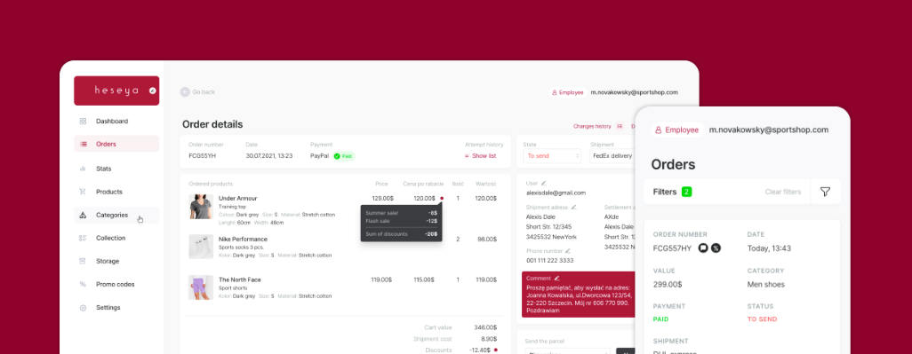

# About Platform

[[toc]]

## Meet Heseya

Heseya is a headless commerce platform that allows businesses
to manage and sell their products and services across multiple channels
without being restricted by a traditional website structure.
Headless commerce means that the front-end presentation layer
is decoupled from the back-end functionality,
giving businesses the flexibility to create custom
front-end experiences tailored to their specific needs.

###  Key Features

#### Headless

Heseya is fully headless. Every operation can be done with API,
both client and admin site. With Heseya,
businesses can create seamless shopping experiences across multiple touchpoints
such as social media, mobile apps, and voice assistants.
The platform provides a comprehensive set of APIs,
enabling businesses to integrate with various third-party systems,
including CRMs, ERPs, and marketing automation tools.

#### Scalable

In addition to its powerful features and flexibility,
Heseya is also highly scalable, making it an ideal choice
for businesses of all sizes. Whether you're just starting
out with a small online store or looking to expand
your existing e-commerce operations,
Heseya can help you achieve your goals and drive growth.

Heseya's ecommerce platform is created with mind to use a distributed infrastructure,
which means that the system is designed to run across multiple servers and data centers.
This approach allows for increased scalability, fault tolerance, and reliability.

#### Modular

One of the significant advantages of Heseya is
it`s flexibility in adapting to changing business needs.
The platform's modular architecture allows businesses
to add or remove features as required, making it easy
to stay ahead of the competition in a fast-paced digital marketplace.

[How to develop Heseya apps](/developer/apps)

#### Low-code

The platform is designed to simplify the ecommerce experience
by providing a low-code solution that reduces the complexity
of building and managing an online store.
With a set of developer tools,
Heseya allows you to create online stores
with just a few lines of code. This means faster and cheaper deployments.

[Learn more about our SDK](/developer/js-sdk)

### Admin Dashboard

Although the use of the panel is completely optional,
Heseya provides a powerful administration dashboard,
with support for nested applications that make it infinitely expandable.

#### Mobile-friendly

The mobile-friendly ecommerce admin dashboard of the Heseya ecommerce platform
is a sleek and modern interface that allows users to easily manage their online store
from their desktops and mobile device. The dashboard is designed with simplicity and user-friendliness in mind,
making it easy for users to navigate and perform various tasks.

#### Expandability

The Heseya admin dashboard is built using a microfrontend architecture,
which means that you can extend its functionality by writing your own microfrontends in any language of your choice.
This allows you to customize the dashboard according to your specific needs and requirements.

[Read more about Microfrontends](/developer/microfrontends)

### Developer Friendly

Heseya is founded by developer, a is designed for developers.
Intuitive and friendly experience for developers, means fast end smooth deployment for business.
